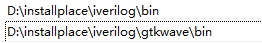
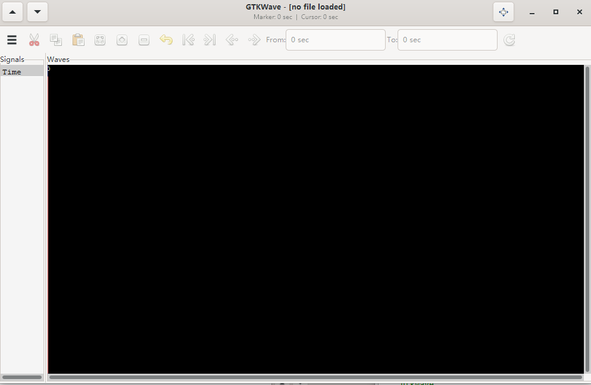
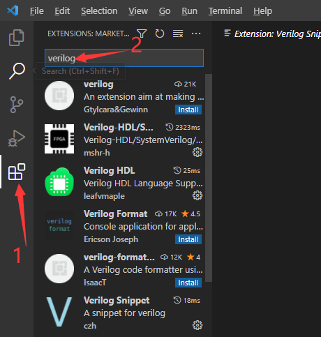
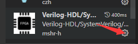
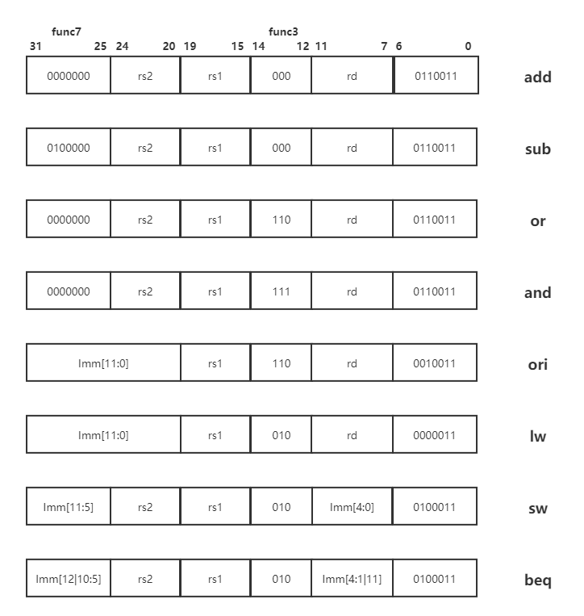
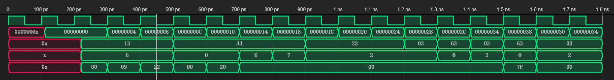

# MySimpleRISC-V 

## 运行环境
win10
 
- ctags
- iverilog 
- gtkwave
- vscode

## 安装流程

[ctags下载](http://ctags.sourceforge.net/)

下载后可以直接解压，然后将ctags的目录加入到环境变量中

[iverilog下载](http://bleyer.org/icarus/)

安装时记得勾选将iverilog和gtkwave加入环境变量，如果未勾选则需自己手动添加

安装iverilog之后gtkwave也会自动安装

安装成功，win+R后输入cmd，然后输入：

    iverilog -help

有以下内容说明成功

	Usage: iverilog [-EiSuvV] [-B base] [-c cmdfile|-f cmdfile]
    [-g1995|-g2001|-g2005|-g2005-sv|-g2009|-g2012] [-g<feature>]
    [-D macro[=defn]] [-I includedir] [-L moduledir]
    [-M [mode=]depfile] [-m module]
    [-N file] [-o filename] [-p flag=value]
    [-s topmodule] [-t target] [-T min|typ|max]
    [-W class] [-y dir] [-Y suf] [-l file] source_file(s)

	See the man page for details.

gtkwave成功标志

	gtkwave

如果跳出gtkwave软件则安装成功

	

[vscode下载](https://code.visualstudio.com/)

vscode的使用习惯大家自行设置，下面主要介绍vscode中需要使用的插件

- Verilog-HDL/SystemVerilog/Bluespec SystemVerilog
- Verilog HDL
- Verilog Snippet

这三个插件直接在应用商店的里面搜索verilog即可

第一个插件是必须的，后面两个属于辅助功能，第二个插件可以让右上角出现一个绿色的按钮，它会帮助我们自动运行verilog代码

最后，打开Verilog-HDL/SystemVerilog/Bluespec SystemVerilog的设置

找到**Extension Settings**,在Path里面输入ctags（不出意外安装好ctags再安装vscode插件的话会自动出现ctags），在Linter里面勾选iverilog，在Arguments里面输入**-i**

我的运行方式是直接点击绿色的按钮，并没有使用命令行的运行方式,绿色按钮如下：

windows下面运行gtkwave可能会有些卡，而且使用起来有些麻烦，所以选择安装vscode插件**WaveTrace**，可以直接在vscode中点击.vcd文件运行

## 指令集

初学RISC-V，指令集设置的非常简单，只有
ADD/SUB/OR/AND/ORI/LW/SW/BEQ

指令格式如下：

每条指令通过opcode func3和func7进行区分

具体的运行流程请参考[RISC-V中文手册](http://crva.ict.ac.cn/documents/RISC-V-Reader-Chinese-v2p1.pdf)和网上的其它资源

## 运行结果展示

执行的指令如下：

	.text
	ori x29, x0, 12			#00
	ori x8, x0, 0x0123		#04
	ori x9, x0, 0x0456		#08
	add x7, x8, x9			#0C
	sub x6, x7, x9			#10
    or  x10, x8, x9			#14
    and x11, x9, x10		#18
	sw x8, 0(x0)			#1C
	sw x9, 4(x0)			#20
	sw x7, 4(x29)			#24
	lw x5, 0(x0)			#28
	beq x8, x5, _lb2		#2C
	_lb1:
	lw x9, 4(x29)			#30
	_lb2:
	lw x5, 4(x0)			#34
	beq x9, x5, _lb1		#38

运行结果如下：

将RISC-V指令翻译成二进制代码可以使用[网站](https://venus.cs61c.org)，也可以和上面的运行结果做对比

## 目录结构

**image**:readme.md中的图片

**include**:代码所需的头文件，目前只有一个定义aluop的头文件

**src**:主要代码

**testbeach**:测试代码

**readme.md**:本文件，负责描述该项目

**test\_8\_Instr.txt**:项目所用指令序列

**test\_instr.dat**:项目指令序列的二进制版本

## 参考资料

感谢[gitee](https://gitee.com/rainrime/very-small-single-circle-riscv-cpu?_from=gitee_search)提供的关于ALU操作码计算的思路以及其测试指令

感谢[github](https://github.com/anhongzhan/Computer-architecture/blob/master/lab2/anotherCPU/CPU.v)，当年自己实现的简单MIPS CPU

## 未来展望

下一步肯定是要扩充指令集，并且逐步实现流水、分支预测、Cache等功能，希望自己可以坚持下去